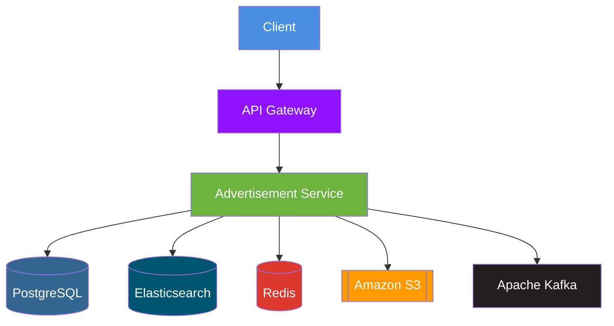

# Advertisement Microservice API

This microservice provides APIs for managing advertisements, categories, cities, and user interactions with advertisements.

## Architecture Diagram

## Introduction

The Advertisement Microservice is part of the EveryBuy marketplace ecosystem designed to handle advertisement. It provides a range of functionalities including creating, updating, filtering, and deleting advertisements. Additionally, it allows managing categories, cities, and regions to support the advertisement listings.

 ## 🛠️ Technologies 

| **Category**       | **Technology**                                                                                                                                | **Use Case**                          |  
|--------------------|-----------------------------------------------------------------------------------------------------------------------------------------------|---------------------------------------|  
| **Framework**      |                            | REST API foundation                   |  
| **Database**       |                              | Primary relational data storage       |  
| **Search**         |                     | Full-text ad search              
| **Caching**        |                                 | High-performance caching layer        |  
| **Message Broker** |                          | Asynchronous event processing         |  
| **Cloud Storage**  |                                  | Ad image storage & retrieval          |  
| **Dev Tools**      | ,  | Boilerplate reduction & DTO mapping |  

- **Spring Boot Web** – provides the foundation for building RESTful APIs.

- **Spring Data JPA** – simplifies database interactions using JPA with Hibernate.

- **Spring Security** – used for securing API endpoints and managing authentication/authorization.

- **Spring Validation** – used for request validation to ensure data consistency.

- **Spring Data Redis** – adds support for Redis-based caching and data storage.

- **Elasticsearch** – used for implementing full-text search capabilities within advertisement listings using the High-Level REST Client

- **Amazon S3 (AWS SDK)** – used for storing and retrieving advertisement images in a cloud-based storage solution

- **MapStruct** – generates mappers for converting between DTOs and entities.

- **Flyway** – used for versioned database schema migrations.

- **PostgreSQL JDBC Driver** – used to connect the microservice with the PostgreSQL database

- **Lombok** – reduces boilerplate code by generating getters, setters, constructors, etc.

## Base URL

https://service-advertisement-r8dt.onrender.com

## Open API Documentation

The OpenAPI documentation for this microservice can be found [here](https://app.swaggerhub.com/apis-docs/OlesiaSmahlii/EveryBuy/1.0#/Advertisement%20service).

